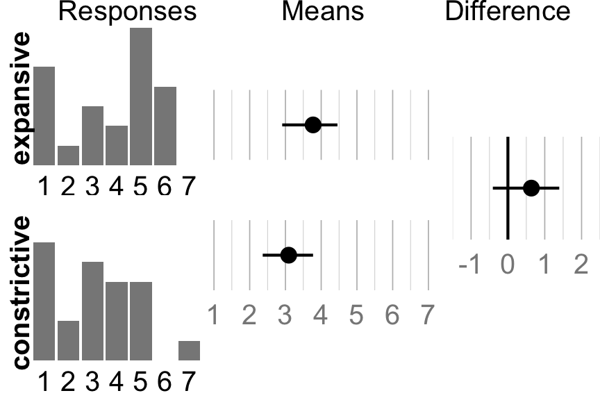
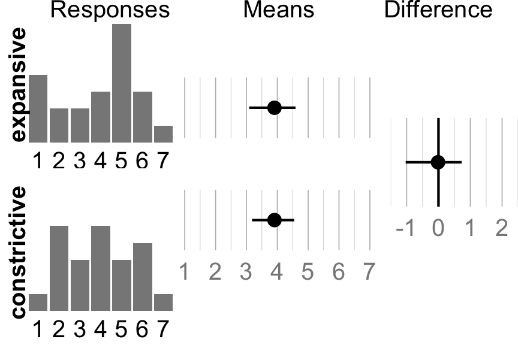
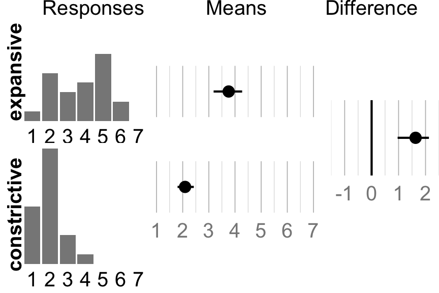

# Analysis script for experiment 1 of the CHI 2018 article:
# How Relevant are Incidental Power Poses for HCI?

2015-18 Yvonne Jansen

Created August 2015, cleaned up January 2018


```r
library("boot")
library("bootES")

source("helper scripts/CI.helpers.R")
source("helper scripts/plotting functions.R")
```

Read the data for experiment 1


```r
d <- read.csv("../data/exp1.csv")
```

Store results for the different items in individual vectors


```r
power_exp <- subset(d, condition_name == "expansive")$power
power_con <- subset(d, condition_name == "constricted")$power

charge_exp <- subset(d, condition_name == "expansive")$in_charge
charge_con <- subset(d, condition_name == "constricted")$in_charge
```

Compute a discomfort measure combining the three measures for difficulty, painfulness, and fatigue


```r
d$discomfort <- (d$difficult + d$painful + d$fatigue)/3

discomfort_exp <- subset(d, condition_name == "expansive")$discomfort
discomfort_con <- subset(d, condition_name == "constricted")$discomfort
```

## Analysis of the 'felt power' measure
Compute bootstrap confidence intervals for the two conditions (expansive and constrictive) and for the difference between them.


```r
mean_power_exp <- meanCI.bootstrap(power_exp)
mean_power_con <- meanCI.bootstrap(power_con)
mean_diff_power <- diffMeanCI.bootstrap(mean_power_exp, mean_power_con)
```

Compute bootstrap standardized effect size (Cohen's d)


```r
power <- data.frame(condition = d$condition_name, power = d$power)
cohen_power <- bootES(power, 
                      data.col= "power", group.col = "condition", 
                      effect.type = "cohens.d", ci.type = "bca", 
                      contrast = c("expansive"=1, "constricted"=-1), R = 10000)
cohen_power_point <- cohen_power[[1]]
cohen_power_ci <- boot.ci(cohen_power, type = "bca", conf = conf.level)
```

### Print results numerically


```r
cat("Results for expansive condition:    ", format_ci(mean_power_exp), "\n")
cat("Results for constrictive condition: ", format_ci(mean_power_con), "\n")
cat("Results for difference:            ", format_ci(mean_diff_power), "\n")
cat("Effect size (Cohen's d):           ", 
    format_ci(c(
      cohen_power_point, 
      cohen_power_ci$bca[4], 
      cohen_power_ci$bca[5])))
```

```
## Results for expansive condition:     3.8, CI [2.9, 4.5] 
## Results for constrictive condition:  3.1, CI [2.4, 3.8] 
## Results for difference:             0.64, CI [-0.41, 1.39] 
## Effect size (Cohen's d):            0.38, CI [-0.25, 1.03]
```

Compile data in a dataframe for plotting


```r
power_df <- NULL
power_df <- add.ci.to.df(mean_power_exp, "expansive", " ", power_df)
power_df <- add.ci.to.df(mean_power_con, "constrictive", " ", power_df)

power_diff_df <- add.ci.to.df(mean_diff_power, "difference")
```

Prepare plots
Histograms for the raw response data 


```r
hist_exp <- histo(power_exp, 1, 7, 8, "expansive", 1, "#888888")
hist_con <- histo(power_con, 1, 7, 8, "expansive", 1, "#888888")
```

Error bar plot for the boostrap CI of the two conditions


```r
power_df_plot <- ci.plot(power_df, 1, 7, "bootstrapped means")
```

Error bar plot for the difference between the two conditions


```r
power_diff_df_plot <- ci.diff.plot(power_diff_df, -1.5, 2.5, "difference", scale.min = -1, scale.max = 2)
```

Lay out the individual charts in a combined one


```r
power_ci_plot <- list(power_df_plot, power_diff_df_plot)
power_plot <- drawVerticalComp(hist_exp, hist_con, power_ci_plot, "expansive", "constrictive", "Means", "Difference")
```

### Show results visually


```r
power_plot
```



To save the produced chart, uncomment the line below 


```r
# save_plot("../charts/exp1/power.pdf", power_plot, base_aspect_ratio = 3, base_height = 2)
```

## Analysis of the 'in charge' measure
Compute bootstrap confidence intervals for the two conditions (expansive and constrictive) and for the difference between them.


```r
mean_charge_exp <- meanCI.bootstrap(charge_exp)
mean_charge_con <- meanCI.bootstrap(charge_con)
mean_diff_charge <- diffMeanCI.bootstrap(mean_charge_exp, mean_charge_con)
```

Compute bootstrap standardized effect size (Cohen's d)


```r
charge <- data.frame(condition = d$condition_name, charge = d$in_charge)
cohen_charge <- bootES(charge, 
                       data.col= "charge", group.col = "condition", 
                       effect.type = "cohens.d", ci.type = "bca", 
                       contrast = c("expansive"=1, "constricted"=-1), R = 10000)
cohen_charge_point <- cohen_charge[[1]]
cohen_charge_ci <- boot.ci(cohen_charge, type = "bca", conf = conf.level)
```

### Print results numerically


```r
cat("Results for expansive condition:    ", format_ci(mean_charge_exp), "\n")
cat("Results for constrictive condition: ", format_ci(mean_charge_con), "\n")
cat("Results for difference:          ", format_ci(mean_diff_charge), "\n")
cat("Effect size (Cohen's d):           ", 
    format_ci(c(
      cohen_charge_point, 
      cohen_charge_ci$bca[4], 
      cohen_charge_ci$bca[5])))
```

```
## Results for expansive condition:     3.9, CI [3.1, 4.6] 
## Results for constrictive condition:  3.9, CI [3.2, 4.5] 
## Results for difference:           -0.015, CI [-1.03, 0.73] 
## Effect size (Cohen's d):            0, CI [-0.61, 0.61]
```

Compile data in a dataframe for plotting


```r
charge_df <- NULL
charge_df <- add.ci.to.df(mean_charge_exp, "expansive", " ", charge_df)
charge_df <- add.ci.to.df(mean_charge_con, "constrictive", " ", charge_df)

charge_diff_df <- add.ci.to.df(mean_diff_charge, "difference")
```

Prepare plots
Histograms for the raw response data 


```r
hist_exp_charge <- histo(charge_exp, 1, 7, 8, "expansive", 1, "#888888")
hist_con_charge <- histo(charge_con, 1, 7, 8, "constrictive", 1, "#888888")
```

Error bar plot for the boostrap CI of the two conditions


```r
charge_df_plot <- ci.plot(charge_df, 1, 7, "bootstrapped means")
```

Error bar plot for the difference between the two conditions


```r
charge_diff_df_plot <- ci.diff.plot(charge_diff_df, -1.5, 2.5, "difference", scale.min = -1, scale.max = 2)
```

Lay out the individual charts in a combined one


```r
charge_ci_plot <- list(charge_df_plot, charge_diff_df_plot)
charge_plot <- drawVerticalComp(hist_exp_charge, hist_con_charge, charge_ci_plot, 
                                "expansive", "constrictive", "Means", "Difference")
```

### Show results visually


```r
charge_plot
```



To save the produced chart, uncomment the line below 


```r
# save_plot("../charts/exp1/in_charge.pdf", charge_plot, base_aspect_ratio = 3, base_height = 2)
```

## Analysis of the 'discomfort' measure
Compute bootstrap confidence intervals for the two conditions (expansive and constrictive) and for the difference between them.


```r
mean_discomfort_exp <- meanCI.bootstrap(discomfort_exp)
mean_discomfort_con <- meanCI.bootstrap(discomfort_con)
mean_diff_discomfort <- diffMeanCI.bootstrap(mean_discomfort_exp, mean_discomfort_con)
```

Compute standardized effect size (Cohen's d)


```r
discomfort <- data.frame(condition = d$condition_name, discomfort = d$discomfort)
cohen_discomfort <- bootES(discomfort, 
                           data.col= "discomfort", group.col = "condition", 
                           effect.type = "cohens.d", ci.type = "bca", 
                           contrast = c("expansive"=1, "constricted"=-1), R = 10000)
cohen_discomfort_point <- cohen_discomfort[[1]]
cohen_discomfort_ci <- boot.ci(cohen_discomfort, type = "bca", conf = conf.level)
```

### Print results numerically


```r
cat("Results for expansive condition:    ", format_ci(mean_discomfort_exp), "\n")
cat("Results for constrictive condition: ", format_ci(mean_discomfort_con), "\n")
cat("Results for difference:          ", format_ci(mean_diff_discomfort), "\n")
cat("Effect size (Cohen's d):           ", 
    format_ci(c(
      cohen_discomfort_point, 
      cohen_discomfort_ci$bca[4], 
      cohen_discomfort_ci$bca[5])))
```

```
## Results for expansive condition:     3.8, CI [3.2, 4.3] 
## Results for constrictive condition:  2.1, CI [1.80, 2.4] 
## Results for difference:           1.63, CI [0.96, 2.1] 
## Effect size (Cohen's d):            1.53, CI [0.85, 2.3]
```

Compile data in a dataframe for plotting


```r
discomfort_df <- NULL
discomfort_df <- add.ci.to.df(mean_discomfort_exp, "expansive", " ", discomfort_df)
discomfort_df <- add.ci.to.df(mean_discomfort_con, "constrictive", " ", discomfort_df)

discomfort_diff_df <- add.ci.to.df(mean_diff_discomfort, "difference")
```

Prepare plots

Histograms for the raw response data 


```r
hist_exp_discomfort <- histo(round(discomfort_exp), 1, 7, 12, "expansive", 1, "#888888")
hist_con_discomfort <- histo(round(discomfort_con), 1, 7, 12, "constrictive", 1, "#888888")
```

Error bar plot for the boostrap CI of the two conditions


```r
discomfort_df_plot <- ci.plot(discomfort_df, 1, 7, "bootstrapped means")
```

Error bar plot for the difference between the two conditions


```r
discomfort_diff_df_plot <- ci.diff.plot(discomfort_diff_df, -1.5, 2.5, "difference", scale.min = -1, scale.max = 2)
```

Lay out the individual charts in a combined one


```r
discomfort_ci_plot <- list(discomfort_df_plot, discomfort_diff_df_plot)
discomfort_plot <- drawVerticalComp(hist_exp_discomfort, hist_con_discomfort, discomfort_ci_plot, "expansive", "constrictive", "Means", "Difference")
```

### Show results visually


```r
discomfort_plot
```



To save the produced chart, uncomment the line below 


```r
# save_plot("../charts/exp1/discomfort.pdf", discomfort_plot, base_aspect_ratio = 3, base_height = 2)
```

## Generate Markdown
To generate a Markdown file for this R code, call **knitr::spin("exp1.R")** in the R console.
