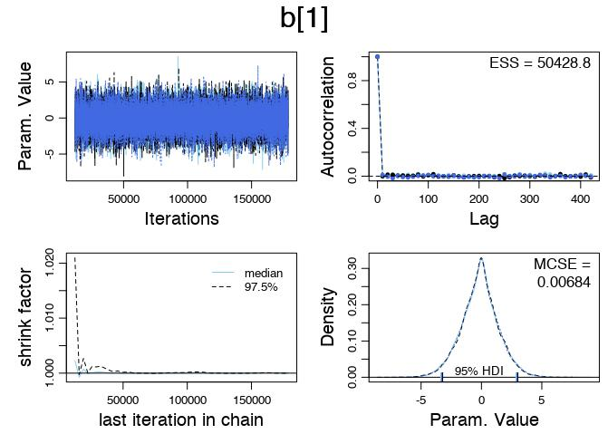
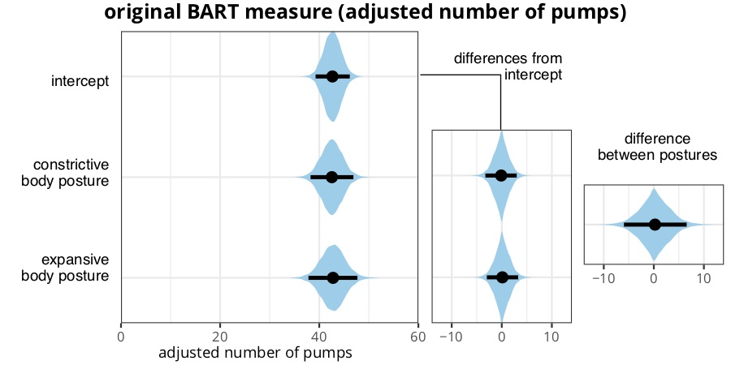
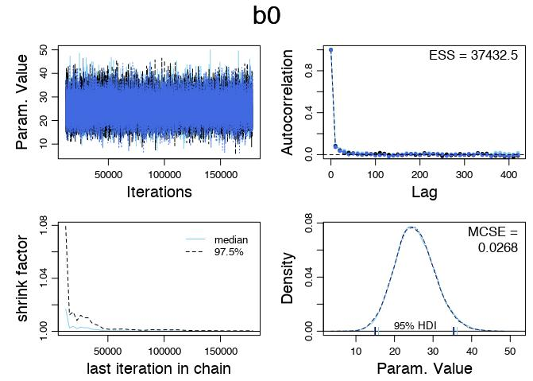
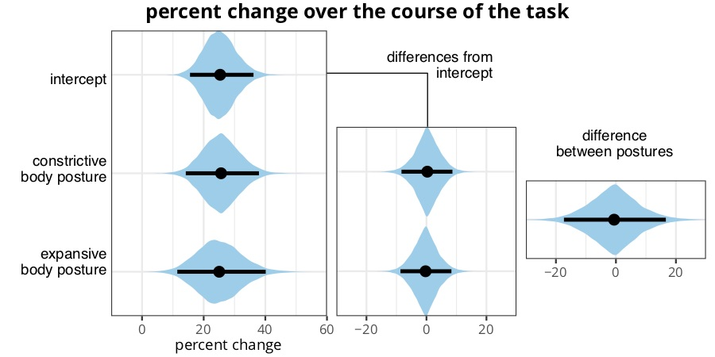
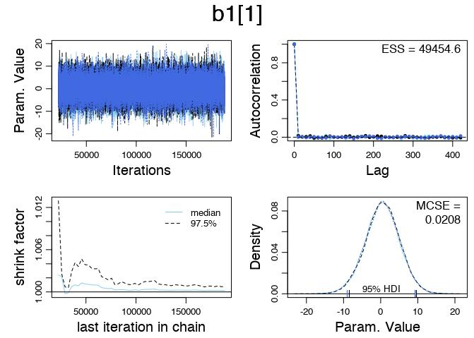
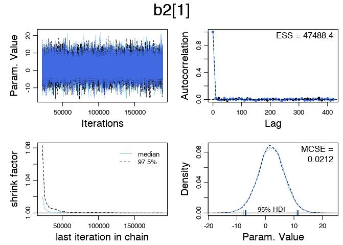
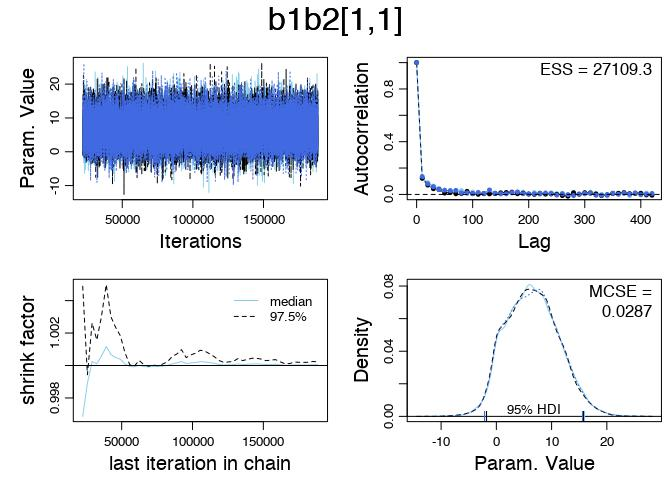
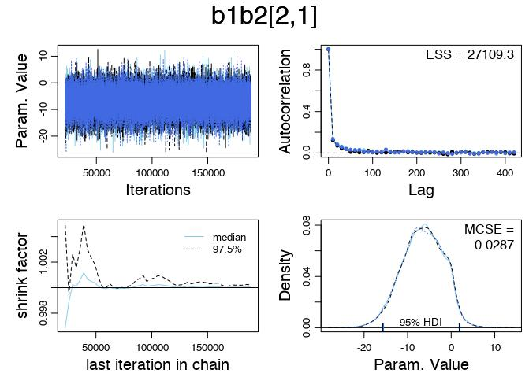
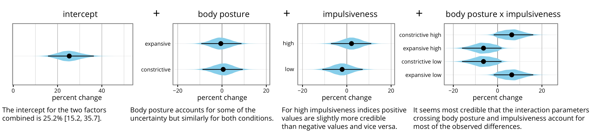

-   [Analysis script for experiment 2 of the CHI 2018
    article:](#analysis-script-for-experiment-2-of-the-chi-2018-article)
-   [How Relevant are Incidental Power Poses for
    HCI?](#how-relevant-are-incidental-power-poses-for-hci)
    -   [Analysing the standard BART measure (average adjusted number of
        pumps)](#analysing-the-standard-bart-measure-average-adjusted-number-of-pumps)
    -   [Analyzing the Change Measure](#analyzing-the-change-measure)
    -   [Part 2: Two-Factor Analysis with covariate
        “impulsiveness”](#part-2-two-factor-analysis-with-covariate-impulsiveness)

Analysis script for experiment 2 of the CHI 2018 article:
=========================================================

How Relevant are Incidental Power Poses for HCI?
================================================

2015-18 Yvonne Jansen

Created August 2016, cleaned up March 2018

Our analysis of the experiment 2 data is based on R code provided by
John K. Kruschke for his book “Doing Bayesian Data Analysis.” We reused
the code to do a robut analysis of metric data with one factorial
predictor (page 573ff).

``` r
source("Jags-Ymet-Xnom1fac-MrobustHet.R")
```

Loading our data…

``` r
d <- read.csv("../data/exp2.csv")
```

Analysing the standard BART measure (average adjusted number of pumps)
----------------------------------------------------------------------

The standard BART measure is the average adjusted number of pumps which
refers to the average number of pumps for balloons which did not
explode. For these balloons the participant made the conscious decision
to take no further risk and to secure the points for the pumps made.

We call the function that analyzes the data using a robust hierarchical
model.

``` r
origMeasure <-  genMCMC(d, "orig", "condition", numSavedSteps = 50000, thinSteps = 10, saveName = "output/orig-")
```

We first check that our Markov chains converged and that they are
healthy and reliable.

``` r
diagOrig <- diagMCMC(origMeasure, parName = "b0", saveName = "output/orig-diag-b0-")
diagOrig <- diagMCMC(origMeasure, parName = "b[1]", saveName = "output/orig-diag-b[1]-")
diagOrig <- diagMCMC(origMeasure, parName = "b[2]", saveName = "output/orig-diag-b[2]-")
```


 

The code from the book comes with an additional function that prints a
summary table with the numerical results of the analysis.

``` r
contrasts = list( 
  list( c("expansive") , c("constrictive") , compVal=0.0  ))
origMeasureSmry <- smryMCMC(origMeasure, d, "condition", contrasts = contrasts, saveName = "output/orig-")
```

``` r
origMeasureSmry
```

    ##                           X  Mean Median     Mode   ESS HDImass  HDIlow
    ## 1                        b0 42.66  42.65 42.58231 50001    0.95 39.2224
    ## 2         b[1] constrictive -0.13  -0.09 -0.00098 50001    0.95 -3.2669
    ## 3            b[2] expansive  0.13   0.09  0.00098 50001    0.95 -2.9605
    ## 4         m[1] constrictive 42.53  42.51 42.24928 50001    0.95 38.1689
    ## 5            m[2] expansive 42.79  42.78 42.73945 49202    0.95 38.0576
    ## 6                    aSigma 13.50   7.66  2.17616  2387    0.95  0.0058
    ## 7    ySigma[1] constrictive 14.21  14.09 13.89990 48603    0.95 11.1079
    ## 8       ySigma[2] expansive 16.31  16.13 15.64527 48525    0.95 12.7560
    ## 9                        nu 48.59  40.12 23.72494 49061    0.95  5.4719
    ## 10               ySigmaMode 13.92  14.18 14.78475 51051    0.95  0.4923
    ## 11                 ySigmaSD 13.34   8.19  2.58041 30653    0.95  0.0056
    ## 12 expansive.v.constrictive  0.26   0.18  0.00196 50001    0.95 -5.9209
    ##    HDIhigh CompVal PcntGtCompVal ROPElow ROPEhigh PcntLtROPE PcntInROPE
    ## 1     46.1      NA            NA      NA       NA         NA         NA
    ## 2      3.0      NA            NA      NA       NA         NA         NA
    ## 3      3.3      NA            NA      NA       NA         NA         NA
    ## 4     46.7      NA            NA      NA       NA         NA         NA
    ## 5     47.8      NA            NA      NA       NA         NA         NA
    ## 6     46.5      NA            NA      NA       NA         NA         NA
    ## 7     17.6      NA            NA      NA       NA         NA         NA
    ## 8     20.1      NA            NA      NA       NA         NA         NA
    ## 9    115.7      NA            NA      NA       NA         NA         NA
    ## 10    24.6      NA            NA      NA       NA         NA         NA
    ## 11    43.7      NA            NA      NA       NA         NA         NA
    ## 12     6.5       0            53      NA       NA         NA         NA
    ##    PcntGtROPE
    ## 1          NA
    ## 2          NA
    ## 3          NA
    ## 4          NA
    ## 5          NA
    ## 6          NA
    ## 7          NA
    ## 8          NA
    ## 9          NA
    ## 10         NA
    ## 11         NA
    ## 12         NA

To visualize the results of our analysis we first need to extract data
from the coda samples object.

``` r
require(coda)
require(plyr)
require(ggplot2)
require(tidybayes)
```

We define a custom function that extracts samples for a list of
parameters from a coda object and returns a list of data frames suitable
for plotting with ggplot.

``` r
### for 2 groups

getParamOfInterest2group <- function(codaSamples, params, whichChain = 1){
  mydf  <- data.frame(parameter = character(), value = list())
  firstChain  <- as.matrix(codaSamples[[whichChain]])

  for (param in params) {
    mydf  <-  rbind(data.frame(parameter = param, value = firstChain[,param]), mydf)
  }
  
  # now the contrast
  
  mydf  <- rbind(data.frame(parameter = "contrast posture", value = firstChain[,"b[2]"] - firstChain[,"b[1]"]), mydf)
  
  # we rename the parameters to achieve proper labeling when plotting
  mydf$parameter  <- revalue(mydf$parameter, 
                             c("b0"="intercept", 
                               "b[1]"="constrictive - intercept",
                               "b[2]"="expansive - intercept",
                               "m[1]"="estimate constrictive",
                               "m[2]"="estimate expansive"))
  
  
  return(mydf)
}
```

Now we are almost ready to plot. We define a custom function that calls
the geom\_eyeh layer function from the tidybayes package with consistent
drawing parameters across different visualizations.

``` r
require(extrafont)

loadfonts()

makeEyePlot <- function(data, measureName, ylimLow = -40, yLimHigh = 60, ticks=NULL, yscaleOrder = NULL, expandYLimits = c(0.1, 0.1)) {
  p  <- ggplot(data=data, mapping = aes(y=parameter, x=value)) + geom_eyeh(fill = "skyblue", .prob = 0.95, size = 1)
  p1  <-  p   + theme_bw() + ylab(measureName) + scale_x_continuous(breaks=ticks) + coord_cartesian(xlim = c(ylimLow, yLimHigh)) + scale_y_discrete(limits = yscaleOrder, expand = expandYLimits) +
    theme(text = element_text(size = 10, family = "Open Sans"),
          axis.title.x = element_blank(), axis.text.y = element_blank(), axis.ticks.y = element_blank(), plot.margin = unit(c(5.5, 5.5, 5.5, 0), "points"))

  
  return (p1) 
}

############################

paramsToExtract <- c("b0", "b[1]", "b[2]", "m[1]", "m[2]")

origMeasureParameters <- getParamOfInterest2group(origMeasure, params = paramsToExtract)
```

For figure 9 we need to divide the data frame to get 3 separate plots:
(1) intercept, means for constrictive and expansive, (2) differences
from the intercept for both body postures, and (3) the contrast, the
difference between the two postures.

``` r
df.originalMeasurePlot1 <- dplyr::filter(origMeasureParameters, parameter %in% c("intercept", "estimate constrictive", "estimate expansive"))

df.originalMeasurePlot2 <- dplyr::filter(origMeasureParameters, parameter %in% c("constrictive - intercept", "expansive - intercept"))

df.originalMeasurePlot3 <- dplyr::filter(origMeasureParameters, parameter %in% c("contrast posture"))


origMeasurePlot1 <- makeEyePlot(df.originalMeasurePlot1, " ", ylimLow = 0, yLimHigh = 60, ticks = c(0, 20, 40, 60))
origMeasurePlot2 <- makeEyePlot(df.originalMeasurePlot2, " ", ylimLow = -14, yLimHigh = 14, ticks = c(-10, 0, 10))
origMeasurePlot3 <- makeEyePlot(df.originalMeasurePlot3, " ", ylimLow = -14, yLimHigh = 14, ticks = c(-10, 0, 10))
```

Now we compile the three plots into one. Doing this with directly with
the cowplot package enables us to minimize the required retouching in a
vector drawing application.

``` r
library(cowplot)
origPlot <- ggdraw() +
  draw_plot(origMeasurePlot3, x = 0.763, y = 0.2, width = 0.24, height = 0.32) +
  draw_plot(origMeasurePlot2, x = 0.555, y = 0.04, width = 0.24, height = 0.63) +
  draw_plot(origMeasurePlot1, x = 0.13, y = 0.04, width = 0.455, height = 0.9) +
  draw_label("original BART measure (adjusted number of pumps)", x = 0.5, y = 0.99, vjust = 1, fontfamily = "Open Sans", fontface = "bold", size = 12) +
  draw_label("adjusted number of pumps", x = 0.35, y = 0.02, vjust = 0, fontfamily = "Open Sans", size = 9) +
  draw_label("intercept", x = 0.15, y = 0.78, hjust = 1, size = 9) +
  draw_label("constrictive\nbody posture", x = 0.15, y = 0.53, hjust = 1, size = 9) +
  draw_label("expansive\nbody posture", x = 0.15, y = 0.27, hjust = 1, size = 9) +
  draw_label("differences from\nintercept", x = 0.77, y = 0.82, hjust = 1, size = 9) +
  draw_label("difference\nbetween postures", x = 0.9, y = 0.6, hjust = 0.5, size = 9) +
  draw_line(x = c(0.575, 0.685, 0.685), y = c(0.795, 0.795, 0.645), size = 0.3)
```

``` r
combinedPlotMain <- ggsave("charts/exp2/Fig9-left.pdf", origPlot, width = 6, height = 3)
```



Analyzing the Change Measure
----------------------------

As with the original BART measure, we call the same function

``` r
changeMeasure <-  genMCMC(d, "change", "condition", numSavedSteps = 50000, thinSteps = 10, saveName = "change-")
```

Then we check that our Markov chains converged and that they are healthy
and reliable.

``` r
diagMCMC(changeMeasure, parName = "b0", saveName = "output/change-diag-b0-")
diagMCMC(changeMeasure, parName = "b[1]", saveName = "output/change-diag-b[1]-")
diagMCMC(changeMeasure, parName = "b[2]", saveName = "output/change-diag-b[2]-")
```



 

``` r
changeMeasureSmry <- smryMCMC(changeMeasure, d, "condition", contrasts = contrasts, saveName = "output/change-")
```

``` r
changeMeasureSmry
```

    ##                           X Mean Median   Mode   ESS HDImass   HDIlow
    ## 1                        b0 25.3  25.08 24.544 36714    0.95  14.9943
    ## 2         b[1] constrictive  0.4   0.33  0.064 48762    0.95  -7.8052
    ## 3            b[2] expansive -0.4  -0.33 -0.064 48762    0.95  -8.7853
    ## 4         m[1] constrictive 25.7  25.51 24.733 43646    0.95  14.1073
    ## 5            m[2] expansive 24.9  24.63 23.627 38011    0.95  11.0122
    ## 6                    aSigma 38.6  21.75  5.859  2660    0.95   0.0037
    ## 7    ySigma[1] constrictive 33.3  32.82 32.782 25616    0.95  20.9214
    ## 8       ySigma[2] expansive 37.7  37.30 36.530 28991    0.95  24.1088
    ## 9                        nu  7.9   4.74  3.478  3912    0.95   1.1854
    ## 10               ySigmaMode 33.6  32.68 32.895 43482    0.95   0.5369
    ## 11                 ySigmaSD 37.8  22.36  6.679 21820    0.95   0.0201
    ## 12 expansive.v.constrictive -0.8  -0.66 -0.128 48762    0.95 -17.5707
    ##    HDIhigh CompVal PcntGtCompVal ROPElow ROPEhigh PcntLtROPE PcntInROPE
    ## 1     35.4      NA            NA      NA       NA         NA         NA
    ## 2      8.8      NA            NA      NA       NA         NA         NA
    ## 3      7.8      NA            NA      NA       NA         NA         NA
    ## 4     37.7      NA            NA      NA       NA         NA         NA
    ## 5     39.3      NA            NA      NA       NA         NA         NA
    ## 6    132.3      NA            NA      NA       NA         NA         NA
    ## 7     45.8      NA            NA      NA       NA         NA         NA
    ## 8     51.7      NA            NA      NA       NA         NA         NA
    ## 9     24.1      NA            NA      NA       NA         NA         NA
    ## 10    62.7      NA            NA      NA       NA         NA         NA
    ## 11   125.0      NA            NA      NA       NA         NA         NA
    ## 12    15.6       0            46      NA       NA         NA         NA
    ##    PcntGtROPE
    ## 1          NA
    ## 2          NA
    ## 3          NA
    ## 4          NA
    ## 5          NA
    ## 6          NA
    ## 7          NA
    ## 8          NA
    ## 9          NA
    ## 10         NA
    ## 11         NA
    ## 12         NA

Now we extract the parameters of interest from the Markov chain object
into a dataframe

``` r
changeMeasureParameters <- getParamOfInterest2group(changeMeasure, params = paramsToExtract)
```

and create again three different data frames to create the visualization
for Figure 9 right.

``` r
df.changeMeasurePlot1 <- dplyr::filter(changeMeasureParameters, parameter %in% c("intercept", "estimate constrictive", "estimate expansive"))

df.changeMeasurePlot2 <- dplyr::filter(changeMeasureParameters, parameter %in% c("constrictive - intercept", "expansive - intercept"))

df.changeMeasurePlot3 <- dplyr::filter(changeMeasureParameters, parameter %in% c("contrast posture"))


changeMeasurePlot1 <- makeEyePlot(df.changeMeasurePlot1, " ", ylimLow = -10, yLimHigh = 60, ticks = c(0, 20, 40, 60))
```

``` r
changeMeasurePlot2 <- makeEyePlot(df.changeMeasurePlot2, " ", ylimLow = -30, yLimHigh = 30, ticks = c(-20, 0, 20))
```

``` r
changeMeasurePlot3 <- makeEyePlot(df.changeMeasurePlot3, " ", ylimLow = -30, yLimHigh = 30, ticks = c(-20, 0, 20))
```

Now we compile the three plots into one. Doing this with directly with
the cowplot package enables us to minimize the required retouching in a
vector drawing application.

``` r
changePlot <- ggdraw() +
  draw_plot(changeMeasurePlot3, x = 0.7, y = 0.2, width = 0.3, height = 0.32) +
  draw_plot(changeMeasurePlot2, x = 0.435, y = 0.04, width = 0.3, height = 0.63) +
  draw_plot(changeMeasurePlot1, x = 0.12, y = 0.04, width = 0.35, height = 0.9) +
  draw_label("percent change over the course of the task", x = 0.5, y = 0.99, vjust = 1, fontfamily = "Open Sans", fontface = "bold", size = 12) +
  draw_label("percent change", x = 0.32, y = 0.02, vjust = 0, fontfamily = "Open Sans", size = 9) +
  draw_label("intercept", x = 0.15, y = 0.78, hjust = 1, size = 9) +
  draw_label("constrictive\nbody posture", x = 0.15, y = 0.53, hjust = 1, size = 9) +
  draw_label("expansive\nbody posture", x = 0.15, y = 0.27, hjust = 1, size = 9) +
  draw_label("differences from\nintercept", x = 0.69, y = 0.82, hjust = 1, size = 9) +
  draw_label("difference\nbetween postures", x = 0.86, y = 0.6, hjust = 0.5, size = 9) +
  draw_line(x = c(0.457, 0.598, 0.598), y = c(0.795, 0.795, 0.645), size = 0.3)
```

Finally we save the plot as a pdf file.

``` r
combinedPlotMain <- ggsave("charts/exp2/Fig9-right.pdf", changePlot, width = 6, height = 3)
```



Part 2: Two-Factor Analysis with covariate “impulsiveness”
----------------------------------------------------------

The final analysis of the article considers a covariate,
“impulsiveness”, measured through the BIS-11 scale. The original BART
article reported a correlation with this measure, and we thus included
it in our study and analyze

``` r
source("Jags-Ymet-Xnom2fac-MrobustHet.R")
```

``` r
change2factor <-  genMCMC(d, "change", "condition", "BIS", numSavedSteps = 50000, thinSteps = 10,  saveName = "output/change-2factors-", nChains = 3)
```

We again check first that our Markov chains converged and that they are
healthy and reliable.

``` r
diagMCMC(change2factor, parName = "b0", saveName = "output/change-2f-diag-b0-")
diagMCMC(change2factor, parName = "b1[1]", saveName = "output/change-2f-diag-b1[1]-")
diagMCMC(change2factor, parName = "b1[2]", saveName = "output/change-2f-diag-b1[2]-")
diagMCMC(change2factor, parName = "b2[1]", saveName = "output/change-2f-diag-b2[1]-")
diagMCMC(change2factor, parName = "b2[2]", saveName = "output/change-2f-diag-b2[2]-")
diagMCMC(change2factor, parName = "b1b2[1,1]", saveName = "output/change-2f-diag-b1b2[1,1]-")
diagMCMC(change2factor, parName = "b1b2[1,2]", saveName = "output/change-2f-diag-b1b2[1,2]-")
diagMCMC(change2factor, parName = "b1b2[2,1]", saveName = "output/change-2f-diag-b1b2[2,1]-")
diagMCMC(change2factor, parName = "b1b2[2,2]", saveName = "output/change-2f-diag-b1b2[2,2]-")

contrastsCondition <- list(
  list(c("expansive"), c("constrictive")))
```


 

 

 

 

``` r
contrastsBIS <- list(
  list(c("high"), c("low")))

contrastsConditionBIS <- list(
  list(
    list(c("expansive"), c("constrictive")),
    list(c("high"), c("low")))
)

change2factorSmry <- smryMCMC(change2factor, d, "condition", "BIS", contrastsCondition, contrastsBIS, contrastsConditionBIS, saveName = "output/change-2factor-")
```

``` r
change2factorSmry
```

    ##                                        X   Mean Median   Mode   ESS
    ## 1                                     b0  25.47  25.28  24.00 38562
    ## 2                     b1[1] constrictive   0.47   0.51   0.47 49057
    ## 3                        b1[2] expansive  -0.47  -0.51  -0.47 49057
    ## 4                             b2[1] high   2.04   2.06   2.00 49616
    ## 5                              b2[2] low  -2.04  -2.06  -2.00 49616
    ## 6            b1b2[1,1] constrictive high   6.53   6.39   6.09 26016
    ## 7               b1b2[2,1] expansive high  -6.53  -6.39  -6.09 26016
    ## 8             b1b2[1,2] constrictive low  -6.53  -6.39  -6.09 26016
    ## 9                b1b2[2,2] expansive low   6.53   6.39   6.09 26016
    ## 10              m[1,1] constrictive high  34.51  34.38  33.80 43166
    ## 11                 m[2,1] expansive high  20.52  19.96  18.60 37792
    ## 12               m[1,2] constrictive low  17.37  16.87  15.90 36514
    ## 13                  m[2,2] expansive low  29.49  29.20  29.51 40688
    ## 14                                  a1SD  50.67  32.62   9.57  1822
    ## 15                                  a2SD  47.52  31.35   8.93  3173
    ## 16                                a1a2SD  30.72  22.11  11.58  3354
    ## 17         ySigma[1,1] constrictive high  32.18  31.30  29.56 40222
    ## 18            ySigma[2,1] expansive high  34.55  33.76  32.30 35555
    ## 19          ySigma[1,2] constrictive low  33.51  32.18  29.57 29979
    ## 20             ySigma[2,2] expansive low  44.88  43.88  42.54 45138
    ## 21                             sigmaMode  42.41  41.92  41.19 47220
    ## 22                               sigmaSD  42.66  41.66  39.17 50001
    ## 23                                    nu   6.73   4.29   2.98  7526
    ## 24              expansive.v.constrictive  -0.93  -1.02  -0.93 49057
    ## 25                            high.v.low   4.09   4.13   4.00 49616
    ## 26 expansive.v.constrictive.x.high.v.low -26.10 -25.58 -24.38 26016
    ##    HDImass   HDIlow HDIhigh CompVal PcntGtCompVal ROPElow ROPEhigh
    ## 1     0.95  15.3570    35.9      NA            NA      NA       NA
    ## 2     0.95  -8.9607     9.3      NA            NA      NA       NA
    ## 3     0.95  -9.3085     9.0      NA            NA      NA       NA
    ## 4     0.95  -7.2493    11.0      NA            NA      NA       NA
    ## 5     0.95 -11.0372     7.2      NA            NA      NA       NA
    ## 6     0.95  -1.8119    15.8      NA            NA      NA       NA
    ## 7     0.95 -15.8271     1.8      NA            NA      NA       NA
    ## 8     0.95 -15.8271     1.8      NA            NA      NA       NA
    ## 9     0.95  -1.8119    15.8      NA            NA      NA       NA
    ## 10    0.95  18.4141    51.5      NA            NA      NA       NA
    ## 11    0.95   3.4319    39.3      NA            NA      NA       NA
    ## 12    0.95   0.3382    35.1      NA            NA      NA       NA
    ## 13    0.95   6.5570    52.7      NA            NA      NA       NA
    ## 14    0.95   0.0020   158.8      NA            NA      NA       NA
    ## 15    0.95   0.0081   146.2      NA            NA      NA       NA
    ## 16    0.95   0.0256    87.4      NA            NA      NA       NA
    ## 17    0.95  17.9931    48.6      NA            NA      NA       NA
    ## 18    0.95  17.8904    53.1      NA            NA      NA       NA
    ## 19    0.95  17.3276    51.7      NA            NA      NA       NA
    ## 20    0.95  26.3021    65.4      NA            NA      NA       NA
    ## 21    0.95  25.7948    60.3      NA            NA      NA       NA
    ## 22    0.95  22.9992    65.3      NA            NA      NA       NA
    ## 23    0.95   1.1144    19.6      NA            NA      NA       NA
    ## 24    0.95 -18.6170    17.9      NA            NA      NA       NA
    ## 25    0.95 -14.4987    22.1      NA            NA      NA       NA
    ## 26    0.95 -63.3084     7.2      NA            NA      NA       NA
    ##    PcntLtROPE PcntInROPE PcntGtROPE
    ## 1          NA         NA         NA
    ## 2          NA         NA         NA
    ## 3          NA         NA         NA
    ## 4          NA         NA         NA
    ## 5          NA         NA         NA
    ## 6          NA         NA         NA
    ## 7          NA         NA         NA
    ## 8          NA         NA         NA
    ## 9          NA         NA         NA
    ## 10         NA         NA         NA
    ## 11         NA         NA         NA
    ## 12         NA         NA         NA
    ## 13         NA         NA         NA
    ## 14         NA         NA         NA
    ## 15         NA         NA         NA
    ## 16         NA         NA         NA
    ## 17         NA         NA         NA
    ## 18         NA         NA         NA
    ## 19         NA         NA         NA
    ## 20         NA         NA         NA
    ## 21         NA         NA         NA
    ## 22         NA         NA         NA
    ## 23         NA         NA         NA
    ## 24         NA         NA         NA
    ## 25         NA         NA         NA
    ## 26         NA         NA         NA

Now we extract the samples for the parameters we want to visualize into
data frame.

``` r
whichChain <- 1
change2factorParameters  <- data.frame(parameter = character(), value = list())
  firstChain  <- as.matrix(change2factor[[whichChain]])
  
  change2factorParameters  <-  rbind(data.frame(parameter = "intercept", value = firstChain[,"b0"]), change2factorParameters)

  change2factorParameters <- rbind(data.frame(parameter = "expansive", value = firstChain[,"b1[2]"]), change2factorParameters)
  
  change2factorParameters <- rbind(data.frame(parameter = "constrictive", value = firstChain[,"b1[1]"]), change2factorParameters)

  change2factorParameters <- rbind(data.frame(parameter = "high", value = firstChain[,"b2[1]"]), change2factorParameters)

  change2factorParameters <- rbind(data.frame(parameter = "low", value = firstChain[,"b2[2]"]), change2factorParameters)

  change2factorParameters <- rbind(data.frame(parameter = "expansive high", value = firstChain[,"b1b2[2,1]"]), change2factorParameters)

  change2factorParameters <- rbind(data.frame(parameter = "expansive low", value = firstChain[,"b1b2[2,2]"]), change2factorParameters)

  change2factorParameters <- rbind(data.frame(parameter = "constrictive high", value = firstChain[,"b1b2[1,1]"]), change2factorParameters)

  change2factorParameters <- rbind(data.frame(parameter = "constrictive low", value = firstChain[,"b1b2[1,2]"]), change2factorParameters)
```

and create again different data frames to create the visualization for
Figure 11.

``` r
df.change2factorPlot1 <- dplyr::filter(change2factorParameters, parameter %in% c("intercept"))

df.change2factorPlot2 <- dplyr::filter(change2factorParameters, parameter %in% c("expansive", "constrictive"))

df.change2factorPlot3 <- dplyr::filter(change2factorParameters, parameter %in% c("high", "low"))

df.change2factorPlot4 <- dplyr::filter(change2factorParameters, parameter %in% c("constrictive high", "constrictive low", "expansive high", "expansive low"))
```

Figure 11 contains 4 separate plots, which we create first independently

``` r
change2factorPlot1 <- makeEyePlot(df.change2factorPlot1, " ", ylimLow = 0, yLimHigh = 55, ticks = c(0, 20, 40), expandYLimits = c(1.5, 0.1))
change2factorPlot3 <- makeEyePlot(df.change2factorPlot3, " ", ylimLow = -20, yLimHigh = 20, ticks = c(-20, 0, 20), yscaleOrder = c("low", "high"), expandYLimits = c(0.1, 1.2))
change2factorPlot4 <- makeEyePlot(df.change2factorPlot4, " ", ylimLow = -25, yLimHigh = 25, ticks = c(-20, 0, 20) , yscaleOrder = c("constrictive high", "expansive high", "constrictive low", "expansive low"))
```

and then compile into one plot. Doing this with directly with the
cowplot package enables us to minimize the required retouching in a
vector drawing application.

``` r
change2factorPlot <- ggdraw() +
  draw_plot(change2factorPlot4, x = 0.78, y = 0.3, width = 0.22, height = 0.6) +
  draw_plot(change2factorPlot3, x = 0.53, y = 0.3, width = 0.18, height = 0.6) +
  draw_plot(change2factorPlot2, x = 0.32, y = 0.3, width = 0.18, height = 0.6) +
  draw_plot(change2factorPlot1, x = 0, y = 0.3, width = 0.25, height = 0.6) +
  draw_label("intercept", x = 0.13, y = 0.99, vjust = 1,  size = 11) +
  draw_label("+", x = 0.3, y = 0.99, vjust = 1,  size = 11) +
  draw_label("body posture", x = 0.42, y = 0.99, vjust = 1,  size = 11) +
  draw_label("+", x = 0.525, y = 0.99, vjust = 1,  size = 11) +
  draw_label("impulsiveness", x = 0.63, y = 0.99, vjust = 1,  size = 11) +
  draw_label("+", x = 0.75, y = 0.99, vjust = 1,  size = 11) +
  draw_label("body posture x impulsiveness", x = 0.99, y = 0.99, vjust = 1, hjust = 1,  size = 11) +
  draw_label("percent change", x = 0.13, y = 0.29, size = 9) +
  draw_label("percent change", x = 0.42, y = 0.29,  size = 9) +
  draw_label("percent change", x = 0.63, y = 0.29, size = 9) +
  draw_label("percent change", x = 0.9, y = 0.29,  size = 9) +
  draw_label("expansive", x = 0.333, y = 0.72, hjust = 1, size = 9) +
  draw_label("constrictive", x = 0.333, y = 0.56, hjust = 1, size = 9) +
  draw_label("high", x = 0.542, y = 0.72, hjust = 1, size = 9) +
  draw_label("low", x = 0.542, y = 0.56, hjust = 1, size = 9) +
  draw_label("constrictive high", x = 0.795, y = 0.79, hjust = 1, size = 9) +
  draw_label("expansive high", x = 0.795, y = 0.69, hjust = 1, size = 9) +
  draw_label("constrictive low", x = 0.795, y = 0.59, hjust = 1, size = 9) +
  draw_label("expansive low", x = 0.795, y = 0.49, hjust = 1, size = 9) +
  draw_label("The intercept for the two factors\ncombined is 25.2% [15,2, 35.7].", x = 0.03, y = 0.2, vjust = 1, hjust = 0, size = 9) +
  draw_label("Body posture accounts for some of the\nuncertainty but similarly for both conditions.", x = 0.26, y = 0.2, hjust = 0, vjust = 1, size = 9) +
  draw_label("For high impulsiveness indices positive\nvalues are slightly more credible\nthan negative values and vice versa.", x = 0.5, y = 0.2, hjust = 0, vjust = 1, size = 9) +
  draw_label("It seems most credible that the interaction parameters\ncrossing body posture and impulsiveness account for\nmost of the observed differences.", x = 0.715, y = 0.2, hjust = 0, vjust = 1, size = 9) 


  change2factorPlot
```

Finally we save the plot as a pdf file.

``` r
combinedPlotMain <- ggsave("../charts/exp2/Fig11.pdf", change2factorPlot, width = 12, height = 3)
```


